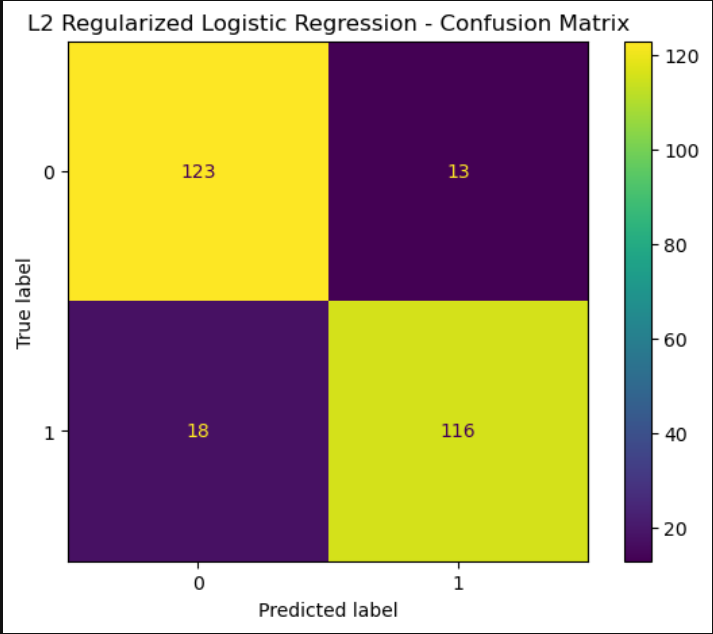
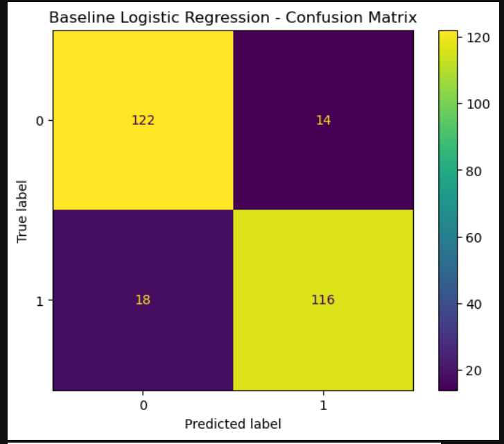
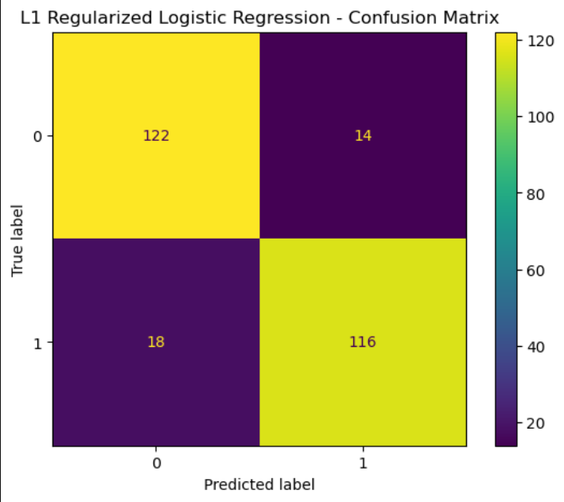
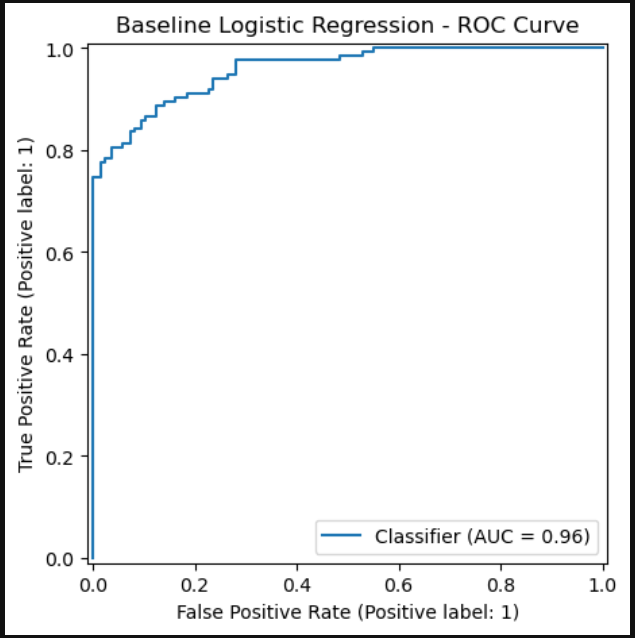
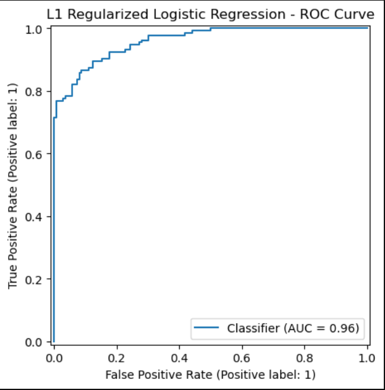

# Employee Turnover Prediction (Logistic Regression + L1/L2 Regularization)

Predict whether an employee is likely to leave the organization using supervised machine learning (Logistic Regression) and compare **Baseline vs L1 (Lasso) vs L2 (Ridge)** regularization.

---

## Project Highlights
- ✅ Clean preprocessing using **Pipeline + ColumnTransformer**
- ✅ Handles **categorical + numerical** features properly
- ✅ Hyperparameter tuning with **GridSearchCV**
- ✅ Full evaluation: **Confusion Matrix, ROC Curve, ROC-AUC, Classification Report**
- ✅ Model interpretation via **coefficients / feature importance**

---

## Repo Structure
```
employee-turnover-prediction/
│── notebooks/
│   └── employee_turnover_project_FINAL.ipynb
│── assets/
│   ├── confusion_matrix_l2.png
│   ├── roc_curve_l2.png
│   └── results_table.png
│── requirements.txt
│── .gitignore
│── README.md
```

> **Note:** If your dataset is large, keep it in a local `data/` folder and exclude it using `.gitignore`.

---

## Dataset
The dataset contains employee-related features such as:
- role / department
- satisfaction and performance-related scores
- salary/income and benefits
- training, overtime, and work-life balance indicators  
- target label: `Employee_Turnover` (**0 = stayed, 1 = left**)

---

## How to Run Locally

### 1) Clone the repo
```bash
git clone https://github.com/<your-username>/employee-turnover-prediction.git
cd employee-turnover-prediction
```

### 2) Install requirements
```bash
pip install -r requirements.txt
```

### 3) Open the notebook
```bash
jupyter notebook
```
Open: `notebooks/employee_turnover_project_FINAL.ipynb`

---

## Methodology

### 1) Preprocessing
Implemented using:
- `StandardScaler()` for numeric features
- `OneHotEncoder(handle_unknown="ignore")` for categorical features
- Full workflow wrapped in a **Pipeline** to avoid data leakage

### 2) Models
- **Baseline Logistic Regression**
- **L1 Regularization (Lasso)**: helps feature selection by shrinking some coefficients to **0**
- **L2 Regularization (Ridge)**: stabilizes coefficients and improves generalization

### 3) Hyperparameter Tuning
Used `GridSearchCV` for:
- `C` values: `[0.01, 0.05, 0.1, 0.5, 1, 2, 5, 10]`
- Scoring: `roc_auc`
- Cross-validation: `cv=5`

---

## Results

### Best model (Final Recommendation)
> ✅ **L2 Regularization Logistic Regression** performed best overall (based on ROC-AUC + balanced precision/recall).

### Metrics used
- Accuracy
- Precision / Recall / F1 Score
- Confusion Matrix
- ROC Curve + ROC-AUC

#### Confusion Matrix (example)


#### ROC Curve (example)


#### Comparison Table (optional)


---

## Key Insights (Interpretation)
Logistic Regression provides model transparency.
- Positive coefficient ⇒ increases probability of turnover
- Negative coefficient ⇒ decreases probability of turnover

Top influencing features are printed at the end of the notebook.

---

## Screenshots: How to Generate (Important)

### Option A (Easiest): Save plots directly from notebook
In the notebook, after each plot add:
```python
plt.savefig("assets/confusion_matrix_l2.png", dpi=200, bbox_inches="tight")
```

For ROC curve:
```python
plt.savefig("assets/roc_curve_l2.png", dpi=200, bbox_inches="tight")
```

### Option B: Take screenshots manually
1. Run the notebook
2. Right-click plot → **Save image**
3. Save inside `assets/`

---


### Additional Plots (Baseline & L1)

#### Baseline Confusion Matrix


#### L1 Confusion Matrix


#### Baseline ROC Curve


#### L1 ROC Curve


## GitHub Upload Steps

### Browser Method
1. Open repo on GitHub
2. Click **Add file → Upload files**
3. Upload folder contents (`notebooks/`, `README.md`, `requirements.txt`, `.gitignore`, `assets/`)
4. Click **Commit changes**

### Git Method
```bash
git init
git add .
git commit -m "Add employee turnover prediction project (final)"
git branch -M main
git remote add origin https://github.com/<your-username>/employee-turnover-prediction.git
git push -u origin main
```

---

## Author
**Nand**

If you want, I can also create:
- ✅ a clean **Project Report PDF**
- ✅ a **presentation PPT** for submission
